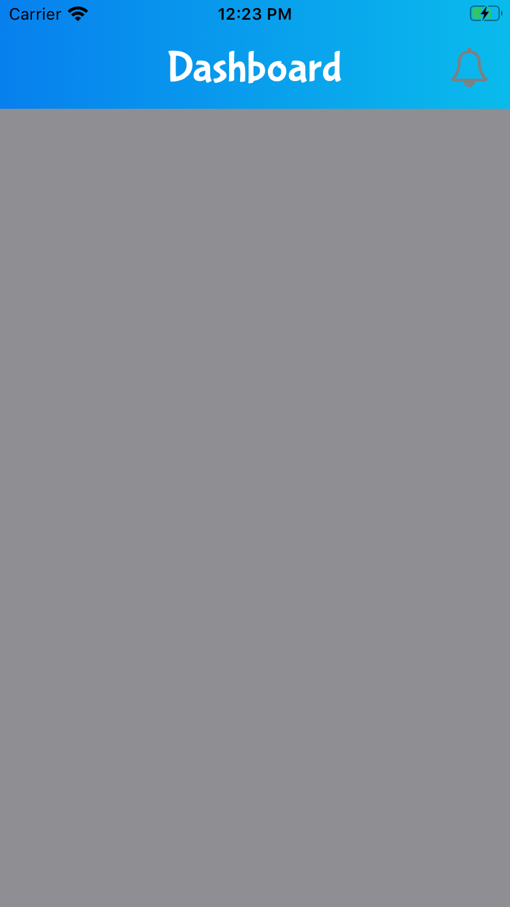
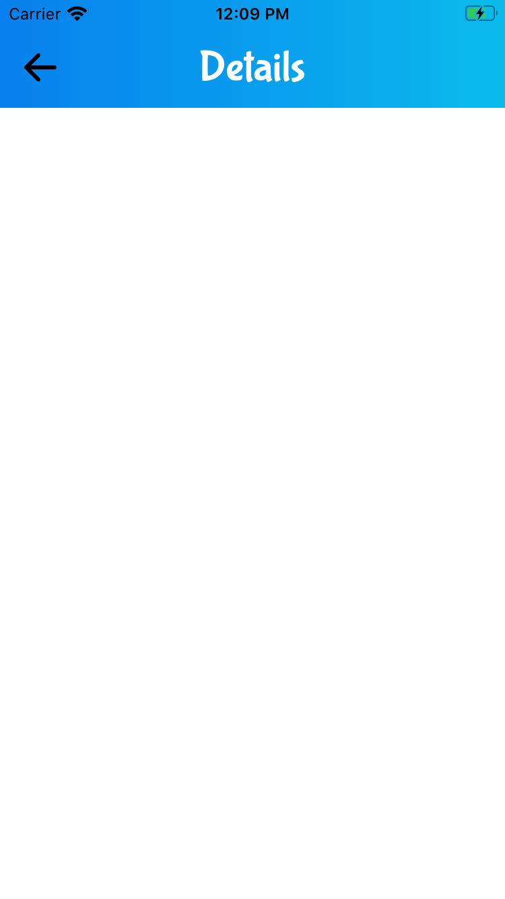

<h1>Introduction</h1>
INTUZ is presenting an interesting Custom Tobar navigation Control to integrate inside your native iOS-based application. 
Tobar is a simple component, which lets you to implement in place of navigation bar which is fully customisation where you can set gradient back ground color with left button view and right button view. 

<br/><br/>
<h1>Features</h1>

- Fully Customisable navigation bar
- You can customze the layout, title with left and right button view.
- You can set different gradient as per the app design requirements.
- Fully customizable layout.

<div style="float:left">


</div>


<br/><br/>
<h1>Getting Started</h1>

To use this component in your project you need to perform the below steps:

> Steps to Integrate


1) Add `TopBarView.swift` at the required place on your code.

2) Add `CustomFont.swift` to set up custom font used in overall application 

3) Add below code where you want to Integrate Custom navigation feature in the controller:

4) You have to add `setTopBarNaviagtion()` function in your each ViewController.

* Add setTopBarNaviagtion() in viewController function:
```
    // MARK: - Set Top Bar
    private func setTopBarNaviagtion() -> Void {
        topbarView = TopBarView(title: "Details", leftOptionImages: ["ic_back"], rightOptionImages: [], showGradiantLayer: true)
        topbarView.titleAlignment = .center
        topbarView.leftOptionDidTapped = { (barItem: UIButton) -> Void in
            self.navigationController?.popViewController()
        }
        topbarView.rightOptionDidTapped = { (barItem: UIButton) -> Void in
            
        }
        self.view.addSubview(topbarView)
    }
```

**Note:** Make sure that the extension which is used in this component has been added to your project. Also add left view back button image and right view button image in Assets  


<br/><br/>
**<h1>Bugs and Feedback</h1>**
For bugs, questions and discussions please use the Github Issues.


<br/><br/>
**<h1>License</h1>**
The MIT License (MIT)
<br/><br/>
Copyright (c) 2020 INTUZ
<br/><br/>
Permission is hereby granted, free of charge, to any person obtaining a copy of this software and associated documentation files (the "Software"), to deal in the Software without restriction, including without limitation the rights to use, copy, modify, merge, publish, distribute, sublicense, and/or sell copies of the Software, and to permit persons to whom the Software is furnished to do so, subject to the following conditions: 
<br/><br/>
THE SOFTWARE IS PROVIDED "AS IS", WITHOUT WARRANTY OF ANY KIND, EXPRESS OR IMPLIED, INCLUDING BUT NOT LIMITED TO THE WARRANTIES OF MERCHANTABILITY, FITNESS FOR A PARTICULAR PURPOSE AND NONINFRINGEMENT. IN NO EVENT SHALL THE AUTHORS OR COPYRIGHT HOLDERS BE LIABLE FOR ANY CLAIM, DAMAGES OR OTHER LIABILITY, WHETHER IN AN ACTION OF CONTRACT, TORT OR OTHERWISE, ARISING FROM, OUT OF OR IN CONNECTION WITH THE SOFTWARE OR THE USE OR OTHER DEALINGS IN THE SOFTWARE.

<br/>
<h1></h1>
<a href="https://www.intuz.com/" target="_blank"></a>


